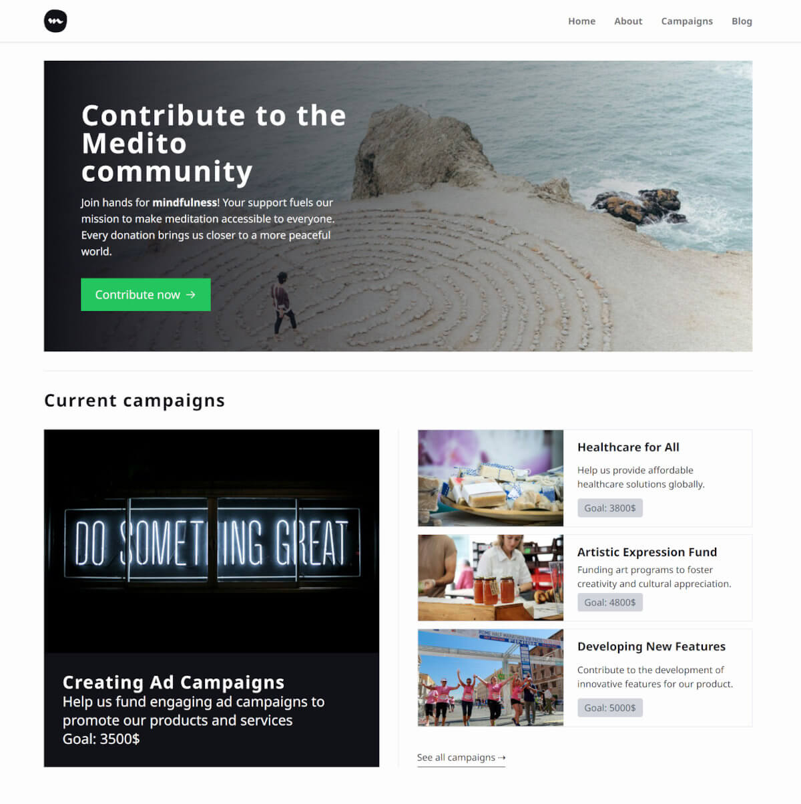
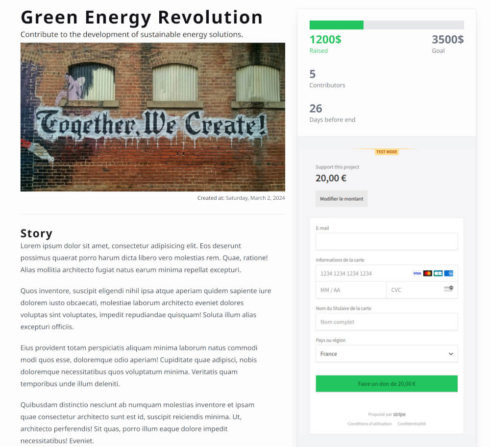

# Medito Fundraising

[](https://astro.build/)
[](https://www.typescriptlang.org/)
[](https://tailwindcss.com/)
[](https://supabase.com/)
[](https://tailwindcss.com/)
[](https://react.dev/)

I have 4 days to develop a Web App for the [Medito foundation](https://meditofoundation.org/).

> Medito Foundation is a nonprofit dedicated to improving mental wellbeing and helping people cope better with depression, stress, anxiety, and any other negative states of mind.

Develop a versatile single web page that can be adapted for various fundraising initiatives, such as hiring personnel, creating ad campaigns, or developing new features. The page should be designed to engage visitors and encourage donations with an interactive and user-friendly interface.

## ✨ Demo

👉 On Cloudflare : https://medito-fundraising.pages.dev/



## 🚨 Prerequisites

You will need:

- [NodeJS](https://nodejs.org/)
- [Git](https://git-scm.com/)
- A terminal to run commands

## 🛠️ Installation

```sh
git clone git@github.com:jeromeabel/medito-fundraising.git
cd medito-fundraising
npm install
```

## 🚀 Utilisation

```sh
npm run dev
```

Open the browser at the address: http://localhost:4321/

## 🧱 Features & Why I Choose This Stack

- **Astro** is an agnostic framework, it offers a great choice for build a **versatile website**. Some pages might be static, server side or client side. You can use all great UI libs as React, Svelte or Vue.
- **Tailwind CSS**: All design is made with Tailwind. It provides great features and it is very popular.
- **Static Blog Posts With Astro**: Some pages are static built by astro from .md files.
- **Campaigns Data With Supabase**: I choose **Supabase** to host fake data into three tables: campaigns, donors, questions
- **API endpoints With Astro**: I create 6 API endpoints in Astro thanks to the **cloudflare adapter** :
  - `/api/campaigns`: Get all campaigns
  - `/api/campaign/:id`: Get one campaign with its id
  - `/api/campaign/:id/donors`: Get all donors for the campaign
  - `/api/campaign/:id/questions`: Get all questions for the campaign
  - `/api/campaign/:id/donate`: Send a request to Stripe
  - `/api/session/:id/`: Get the session data from the validated Stripe session
- **💳 Payment With Stripe Checkout Form**: You have to fill "4242 4242 4242 4242" as a test card number to test the transaction. You would be redirected to the "thanks" page when the transaction is fullfilled.
- **React**: It is used for some more interactive components, CampaignProgress, Dropdown, CampaignDonors. The data are updated every 30s.



## 📝 Documentation

- User Stories: [Kanban](https://github.com/users/jeromeabel/projects/6/views/1)

## ⏳ Future Improvements

- Rewards animations (confetti)
- Improve responsive layout for the campaign page
- Responsive menu
- Add rewards
- Add some Toast feedbacks
- Update donors data with the transaction
- Update blog content with a headless CMS
- Handle progress bar when the goal is reached : 100%
- Clean code: error boundaries, refactoring API calls
- Optimization: loading states, suspense

## Credits

- The Hero image from [unplash/Ashley Batz](https://unsplash.com/fr/photos/personne-marchant-sur-la-plage-pendant-la-journee-betmVWGYcLY)
- The 404 image from [unplash/Tim Goedhart](https://unsplash.com/fr/photos/enseignes-au-neon-breathe-vnpTRdmtQ30)
- All images from unsplash.com
